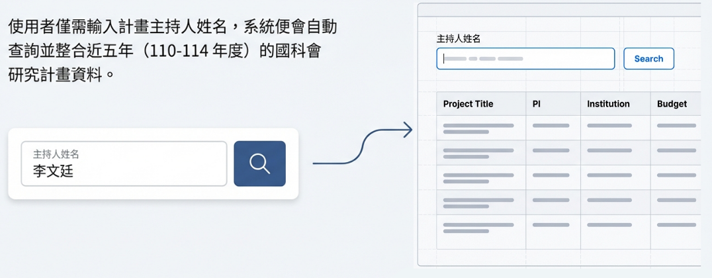
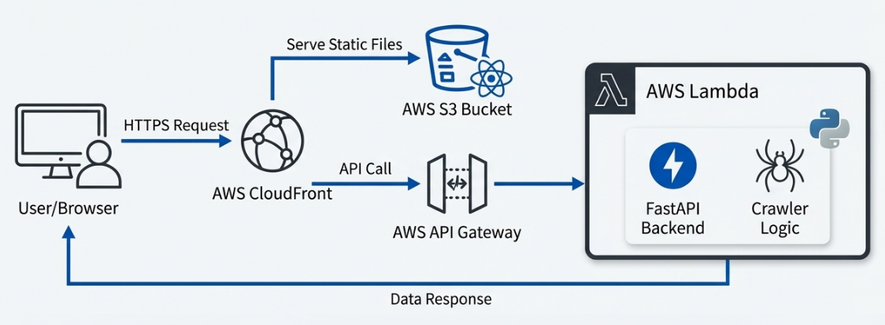
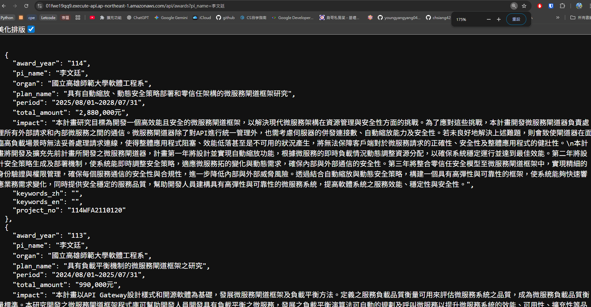
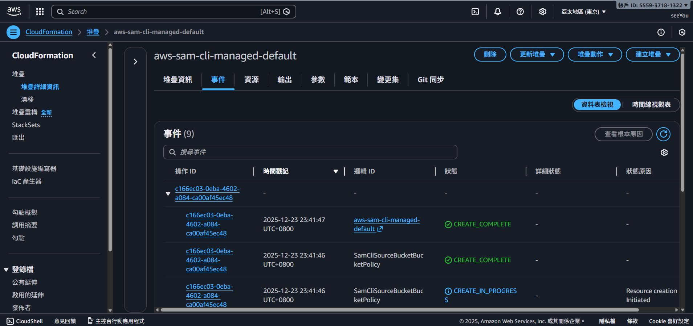
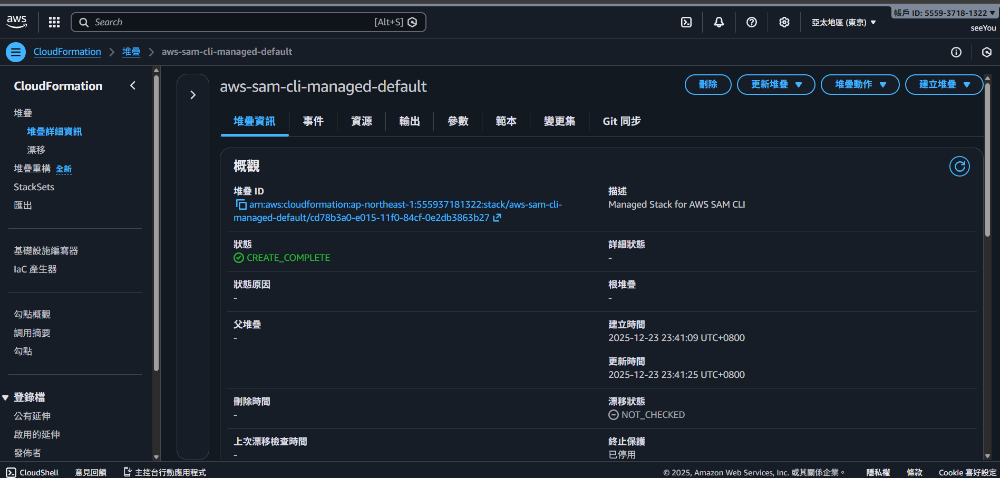
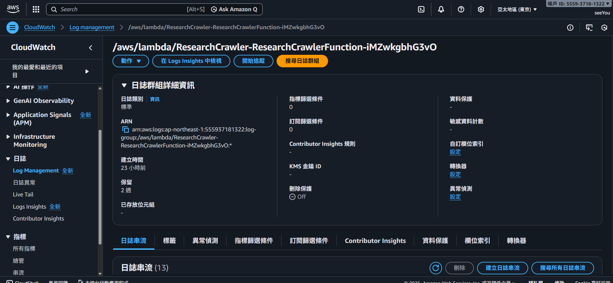
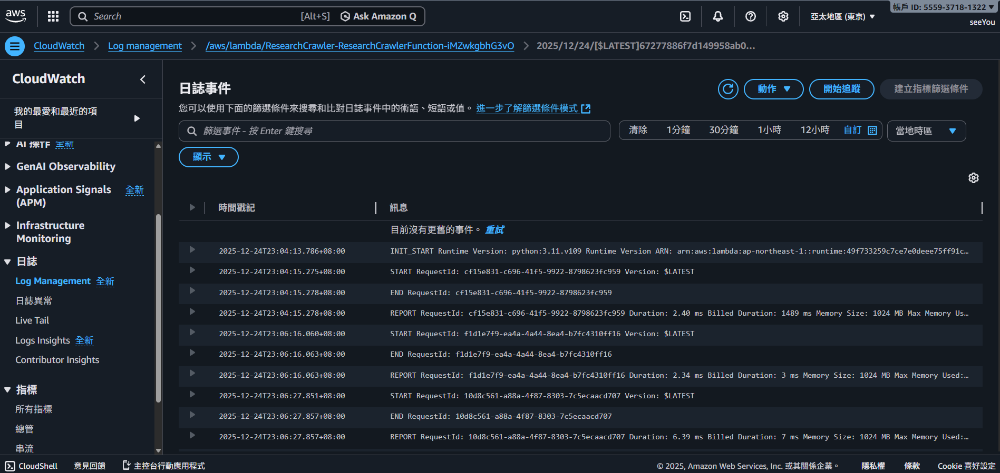
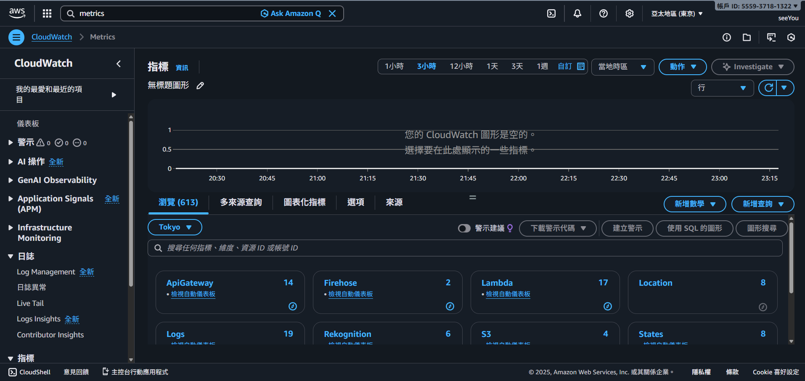
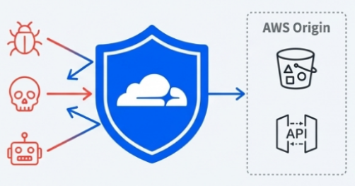
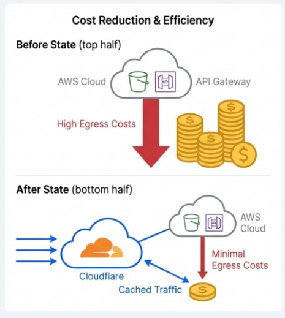

# 期末專題成果報告：ResearchCrawler 研究計劃資料爬蟲與可視化平台

**課程名稱：** 網際服務軟體工程  
**小組成員：** 林士祐、吳傢澂、洪群倫、洪唯仁、楊育丞  
**專案儲藏庫：** [github.com/lin0813you/ResearchCrawler](https://github.com/lin0813you/ResearchCrawler)  
**專案網址：** [https://lin0813you.com/](https://lin0813you.com/)

---

## 1. 專題簡介與問題定義

### 1.1 背景與痛點
在台灣學術環境中，國科會（NSTC）計畫資料是衡量研究能量與活躍度的重要指標。然而，官方查詢系統面臨以下挑戰：
*   **操作破碎化**：介面設計較為老舊，且預設一次僅能查詢單一年度。
*   **彙整成本高**：若要評估一位計畫主持人（PI）近年來的研究軌跡（如 110–114 近五年資料），使用者必須手動重複執行五次查詢並自行在 Excel 中整理數據。

### 1.2 解決方案：ResearchCrawler
本專案開發了 **ResearchCrawler**，一個全端、無伺服器架構的自動化整合平台。
*   **智慧化查詢**：使用者僅需輸入「主持人姓名」，系統後端即自動併發爬取並整合 114 至 110 年度的完整計畫資料。
*   **數據結構化**：透過後端解析將非結構化的網頁 HTML 轉換為標準 JSON 格式。
*   **現代化 UI/UX**：前端將計畫摘要、金額、執行期程與編號進行可視化呈現，大幅提升學術資訊獲取效率。

*圖 1：使用者僅需單一輸入，系統便會自動跨年度整合近五年國科會計畫資料。*

---

## 2. 最終系統架構與服務選型理由

本專案全面採用 **AWS SAM (Serverless Application Model)** 實作基礎設施即代碼 (IaC) 管理，確保環境可重現性與自動化部署。

### 2.1 基礎設施組件解析 (基於 template.yaml)
根據 `template.yaml` 定義，本系統由以下核心組件構成：
*   **後端入口 (AWS::Serverless::HttpApi)**：
    *   採用 HTTP API 以獲得更低的延遲與成本。
    *   **CORS 配置**：實作全開放策略（AllowOrigins: '*'），允許前端 React 應用從不同網域（如 CloudFront 或本機環境）安全調用 API。
*   **運算核心 (AWS::Serverless::Function)**：
    *   使用 **Python 3.11** 運行環境。
    *   **超時與記憶體優化**：考慮到爬蟲需模擬多次 HTTP 請求，將 `Timeout` 設定為 28 秒（接近 API Gateway 上限），並配置 1024MB 記憶體以確保解析效率。
*   **前端託管與分發 (S3 + CloudFront)**：
    *   **S3 Bucket**：開啟 `WebsiteConfiguration` 作為靜態檔案源。
    *   **CloudFront**：強制 `redirect-to-https` 確保傳輸安全。特別實作了 **CustomErrorResponses**，將 403/404 錯誤導向 `index.html`，完美支援 React Router 的前端路由機制。

*圖 2：從使用者瀏覽器發起 HTTPS 請求，到後端 Lambda 執行爬蟲邏輯的完整流程。*

*圖 3：後端選用 FastAPI + Mangum；前端使用 React + Vite；基礎設施則透過 SAM 與 Docker 進行封裝。*

---

## 3. 核心功能實作展示

### 3.1 流程一：自動化查詢與數據解析流程 (Query & Crawl Flow)
1.  **請求觸發**：前端 React 呼叫 `/api/awards?pi_name=李文廷`。
2.  **後端處理**：Lambda 接收請求，執行 `crawler.py`。系統模擬 POST 請求至國科會網站，自動涵蓋 110–114 五個年度。
3.  **數據正規化**：透過 `models.py` (Pydantic) 將原始 HTML 表格解析為結構化物件，包含金額、摘要與計畫編號。

**【實作證據：API 端點測試】**

*圖 4：瀏覽器直接呼叫 Lambda 生產環境端點，正確回傳 114 年度研究計畫之 JSON 結構化數據。*

### 3.2 流程二：自動化 IaC 部署流程 (IaC Deployment Flow)
本專案不透過手動點選控制台，而是落實 DevOps 精神：
1.  **程式碼定義**：在 `template.yaml` 定義所有資源關係。
2.  **SAM 指令流**：執行 `sam build` 進行容器化打包，隨後透過 `sam deploy` 將變更集推送到 AWS CloudFormation。

**【實作證據：CloudFormation 部署紀錄】**

*圖 6：AWS 控制台紀錄顯示 SAM 成功觸發 `aws-sam-cli-managed-default` 堆疊之資源建立事件。*

*圖 7：系統所有資源（API, Lambda, S3）均已達到 `CREATE_COMPLETE` 狀態。*

---

## 4. 非同步設計說明 (SQS/SNS/EventBridge)

為了提升系統的穩定性與未來擴充性，本專案針對長耗時的爬蟲任務設計了以下非同步架構方案，以解決同步請求可能面臨的逾時與效能瓶頸。

### 4.1 任務解耦與削峰填谷 (SQS)
*   **設計動機**：目前系統爬取 110–114 五個年度的資料約需 5-10 秒。在高併發情況下，若大量使用者同時查詢，直接同步等待可能導致 API Gateway 觸發 29 秒的硬性超時限制。
*   **解決方案**：規劃導入 **Amazon SQS** 作為緩衝。前端發起請求後，由 Lambda 快速回傳「任務已接收」並將任務寫入 SQS；後端專屬爬蟲 Lambda 再從 SQS 異步領取任務進行處理，實現請求與運算解耦。

### 4.2 排程自動化與數據預緩存 (EventBridge)
*   **設計動機**：過去年度（如 110-113 年）的研究計畫資料屬於歷史數據，不會頻繁變動，每次即時爬取會造成不必要的延遲。
*   **解決方案**：利用 **EventBridge 排程功能 (Cron)**，設定在每週固定時間自動觸發爬蟲 Lambda 進行「預爬取」。將結果存入資料庫或快取層，當使用者查詢時即可實現「零等待」的秒開體驗。

### 4.3 異常告警與可靠性設計 (SNS & DLQ)
*   **死信佇列 (DLQ)**：針對多次嘗試解析失敗（如國科會網站結構微調）的任務，自動轉入 DLQ，避免任務遺失。
*   **主動通知 (SNS)**：當 DLQ 堆積或 Lambda 發生嚴重錯誤時，系統會透過 **Amazon SNS** 發送即時告警通知開發團隊，確保維運人員能第一時間修正爬蟲解析邏輯。

---

## 5. 可觀測性設計 (Observability)

我們利用 **Amazon CloudWatch** 構建了完整的監控體系，確保爬蟲在生產環境中的穩定性。

### 5.1 日誌追蹤與指標分析
*   **Lambda Logs**：追蹤爬蟲的執行軌跡。當國科會網站結構變更導致解析失敗時，工程師能從日誌中精確找出錯誤位置。
*   **效能指標**：監控 Lambda 的 `Billed Duration`，確保爬蟲任務在預算範圍內高效運行。

**【實作證據：監控儀表板】**

*圖 8：生產環境中 Lambda 函數之日誌串流紀錄，保存了過去所有查詢行為。*

*圖 9：單次請求的執行細節，顯示執行時間與記憶體使用量，利於效能調優。*

*圖 10：CloudWatch 指標儀表板，即時監控 API Gateway (14 次呼叫) 與 Lambda (17 次調用) 的活躍度。*

---

## 6. 安全性與 IAM 設計原則

*   **最小權限原則 (Least Privilege)**：Lambda 僅綁定 `AWSLambdaBasicExecutionRole`，權限嚴格限制在寫入日誌，無權存取其他 AWS 資源，防止程式碼注入攻擊後的損害擴大。
*   **邊緣防護設計**：整合 **Cloudflare WAF**，在請求進入 AWS 網路前先過濾惡意 Bot、DDoS 攻擊與 SQL Injection。

  
*圖 11：透過 Cloudflare 作為防護層，隔離惡意流量，僅允許合法請求進入 AWS Origin。*

---

## 7. 成本與限制說明

### 7.1 成本優化效益
本專案實現了極高的成本效益：
*   **Serverless 架構**：無人查詢時，Lambda 與 API Gateway 產生零成本。
*   **流量節流 (Egress Saving)**：導入 Cloudflare 後，大量靜態資源（JS, CSS, Images）直接由邊緣節點緩存回傳，大幅減少了 S3 與 CloudFront 的出站流量費用。

  
*圖 12：Before（高流量成本）與 After（利用緩存實現最小流量支出）的對比示意圖。*

### 7.2 系統限制
*   **第三方網站依賴**：爬蟲高度依賴國科會網站 HTML 標籤結構。若對方進行大幅改版，需手動更新 `crawler.py` 的解析選擇器。
*   **響應延遲**：即時爬取受限於第三方伺服器，若國科會網站反應慢，使用者可能需等待 5-10 秒。

---

## 8. 個人分工說明

| 姓名 | 百分比 | 主要負責項目 |
| :--- | :--- | :--- |
| **林士祐** |  |  |
| **吳傢澂** |  |  |
| **洪群倫** |  |  |
| **洪唯仁** |  |  |
| **楊育丞** |  |  |

---
**附件：實作證據截圖請參閱 `evidence/` 資料夾。**
