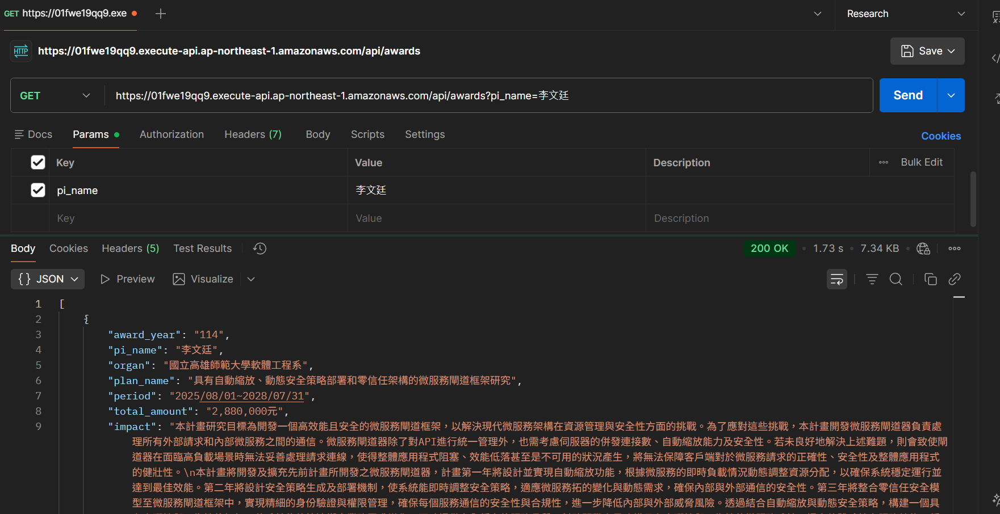

# 期末專題成果報告：ResearchCrawler 研究計劃資料爬蟲與可視化平台

**課程名稱：** 網際服務軟體工程  
**小組成員：** 林士祐、吳傢澂、洪群倫、洪唯仁、楊育丞  
**專案儲藏庫：** [github.com/lin0813you/ResearchCrawler](https://github.com/lin0813you/ResearchCrawler)  
**專案網址：** https://lin0813you.com/

---

## 1. 專題簡介與問題定義

### 1.1 背景與痛點
在台灣學術環境中，國科會計畫資料是研究能量的重要指標。然而，官方查詢系統介面操作零碎，且一次僅能查詢單一年度，導致使用者若要彙整一位計畫主持人（PI）近年來的完整研究軌跡（如 110–114 近五年資料），必須進行多次重複查詢與手動整理。

### 1.2 解決方案：ResearchCrawler
本專案開發了 **ResearchCrawler**，這是一個全端、無伺服器架構的自動化查詢平台。
*   **單一輸入，五年呈現**：使用者僅需輸入「主持人姓名 (pi_name)」，系統即自動爬取 114 至 110 年度的資料。
*   **結構化數據**：將非結構化的網頁資訊轉換為中文欄位清晰的 JSON 資料。
*   **可視化體驗**：前端將計畫摘要、金額、期程與編號完整呈現，提升學術資訊獲取效率。

---

## 2. 最終系統架構與服務選型理由

本專案全面採用 AWS SAM (Serverless Application Model) 進行基礎設施即代碼 (IaC) 管理。

### 2.1 基礎設施組件 (基於 template.yaml)
*   **後端入口 (HTTP API)**：使用 `AWS::Serverless::HttpApi`。配置了全開放的 CORS 策略（AllowOrigins: '*'），確保前端能跨網域調用 API。
*   **運算核心 (Lambda)**：使用 `AWS::Serverless::Function`。配置為 Python 3.11 運行環境，Timeout 設定為 28 秒以應對爬蟲可能的延遲，並賦予 `AWSLambdaBasicExecutionRole` 基礎權限。
*   **前端託管 (S3)**：使用 `AWS::S3::Bucket` 開啟靜態網站託管功能，並透過 `BucketPolicy` 開放 PublicRead 權限。
*   **全球加速 (CloudFront)**：使用 `AWS::CloudFront::Distribution`。將 S3 靜態網址作為 Origin，配置 HTTPS 強制跳轉，並處理了 SPA 應用常見的 403/404 錯誤頁面跳轉至 `index.html`。

---

## 3. 核心功能實作展示

### 3.1 流程：自動化查詢與數據解析 (Query Flow)
使用者透過 API 獲取 114–110 年度的結構化數據。
1. **呼叫 API**：發送 `GET /api/awards?pi_name=李文廷`。
2. **數據建模**：利用 `models.py` (Pydantic) 嚴格定義回傳欄位（包含摘要、關鍵字、計畫編號等）。

**【實作證據：API 呼叫範例與結果】**

---

## 4. 工程實務與部署證據 (IaC)

我們透過 AWS SAM CLI 自動化建立所有雲端資源，落實 DevOps 實務。

### 4.1 自動化部署證據
透過 `sam deploy --guided` 成功建立 CloudFormation 堆疊，確保環境的一致性與可重現性。

**【實作證據：AWS CloudFormation 部署成功】**

---

## 5. 可觀測性設計 (Observability)

利用 Amazon CloudWatch 收集執行記錄與指標，監控 Lambda 的執行效能與穩定性。

### 5.1 日誌與指標監控
*   **日誌追蹤**：詳細紀錄 Lambda 的 INIT、START、END、REPORT 資訊，用以計算 Billed Duration。
*   **指標面板**：監控 API Gateway 的調用次數與 Lambda 的調用頻率。

**【實作證據：CloudWatch Logs & Metrics】**

---

## 6. 安全性與 IAM 設計原則

*   **IAM 最小權限**：Lambda 僅使用 `AWSLambdaBasicExecutionRole`，限制其僅能寫入 CloudWatch Logs，不具備其他多餘的 AWS 管理權限。
*   **CORS 保護**：在 API Gateway 層級定義允許的方法（GET, OPTIONS），過濾不必要的請求類型。
*   **邊緣防護**：如簡報所示，利用 Cloudflare 擋掉異常的 Bot 流量，保護 AWS Origin 的安全。

---

## 7. 成本與限制說明

### 7.1 成本優化
*   **Serverless 低成本**：如簡報分析，利用 AWS Lambda 的免費額度，在無人查詢時成本趨近於零。
*   **流量節流**：透過 Cloudflare 緩存靜態資源，大幅減少 S3 與 CloudFront 的出站流量費用。

### 7.2 系統限制
*   **依賴第三方網站**：爬蟲高度依賴國科會網站結構。若對方更動 HTML ID，系統需更新 Selector 邏輯。
*   **同步執行限制**：目前 Lambda Timeout 設定為 28 秒（對應 API Gateway 限制）。若國科會伺服器反應過慢，可能導致超時。

---

## 8. 個人分工說明

| 姓名 | 百分比 | 主要負責項目 |
| :--- | :--- | :--- |
| **林士祐** |  |  |
| **吳傢澂** |  |  |
| **洪群倫** |  |  |
| **洪唯仁** |  |  |
| **楊育丞** |  |  |

---
**附件：實作證據截圖請參閱 `evidence/` 資料夾。**
